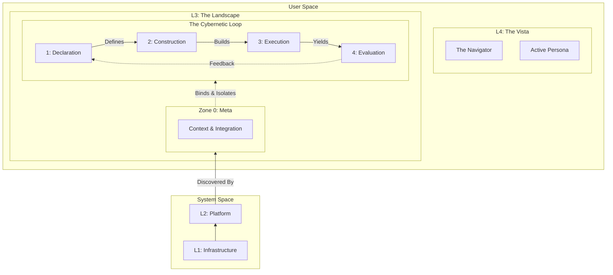

# Unilateral: The Landscape & Vista Architecture
### A Cybernetic Ecosystem for the AI-Native Era

## 1. The Paradigm Shift

We accept that the **System Layers**—**Infrastructure** (Compute/Network/Storage) and **Platform** (K8s/Databases/Utilities)—are solved problems. They provide the stable bedrock (the physics and the tools) of our digital world.

However, the traditional **User Space** is obsolete. We are replacing the rigid "Service/App" dichotomy with a **Cybernetic Model**: an autopoietic (self-creating) system that evolves through a continuous lifecycle pulse.

* **Layer 3 (The Reality):** **The Landscape** — An abstract ecosystem logic instantiated into **Twin Worlds**, governed by a 6-Zone Lifecycle.
* **Layer 4 (The Perspective):** **The Vista** — The subjective, curated interface for interaction.

## 2. The Architectural Axioms

We define the system not as a stack of services, but as a **Cybernetic Loop** (The Landscape) observed through a **Curated Lens** (The Vista).

To ensure zero ambiguity, every component in the system is mapped to a specific coordinate in the **Time-Space Matrix**:
* **Time (The Zones):** The lifecycle stage (0–4).
* **Physics (The Planes):** The fundamental force governing the artifact.

### The Four Planes (Physics)
1.  **Data Plane (Matter):** Persistence, I/O, State, Throughput.
2.  **Control Plane (Order):** Wiring, Scheduling, Topology, Synchronization.
3.  **Cognitive Plane (Intelligence):** Inference, Ontology, Semantic Reasoning.
4.  **Interaction Plane (Interface):** Management (Intent), Observability (Visibility), Governance (Boundaries).

---

## 3. Layer 3: The Landscape (The Objective Reality)

### Zone 0: Meta (Context & Integration)
**Purpose:** The Bootstrap Layer. Defining the environment where the Landscape exists.

| Plane | Specification | MECE Rationale |
| :--- | :--- | :--- |
| **Data** | **Entity Registry** | The raw catalog of available Platform entities (physical resource handles, secrets, endpoints). |
| **Control** | **Isolation Logic** | The boundary enforcement between Twin Worlds (e.g., Network Policies that separate Prod from Sim). |
| **Cognitive** | **Context Injection** | The semantic metadata that grounds an Agent in its reality (e.g., "You are in a Simulation," "You are in Prod"). |
| **Interaction** | **Platform Binding** | The contract defining authentication boundaries and protocol adapters between the Landscape and the external Platform. |

### Zone 1: Declaration (Law & Ontology)
**Purpose:** The Crystallization of Intent. Defining *what* exists before it is built.

| Plane | Specification | MECE Rationale |
| :--- | :--- | :--- |
| **Data** | **Component Specs** | The immutable I/O contracts. Defines inputs, outputs, and data shapes (Schema) for every component. |
| **Control** | **Dependency Graph** | The declared topology. Defines the prerequisite relationships ($A \to B$) and communication patterns. |
| **Cognitive** | **Ontology** | Defines **Latent Behaviors** (Quality, Reliability) and semantic relationships. Describes *meaning* beyond structure. |
| **Interaction** | **Documentation** | The human-readable intent. Includes Status Criteria (Definition of Done) optimized for AI indexing. |

### Zone 2: Construction (Wiring & Instrumentation)
**Purpose:** The Materialization of Intent. Transforming Law into Capability.

| Plane | Specification | MECE Rationale |
| :--- | :--- | :--- |
| **Data** | **Artifact Compilation** | The generation of static binaries, containers, and configuration blobs ready for deployment. |
| **Control** | **Deployment Pipeline** | The logic that executes the build, handles versioning, and validates artifact integrity. |
| **Cognitive** | **Agent Wiring** | The explicit connection of Autonomous Agents to specific Roles. Configures memory scopes and tool access. |
| **Interaction** | **Instrumentation** | The injection of Observability hooks (Tracing, Logging) and CMS layouts *into* the artifacts. |

### Zone 3: Execution (Operation & Matter)
**Purpose:** The Realization of Value. The active runtime state.

| Plane | Specification | MECE Rationale |
| :--- | :--- | :--- |
| **Data** | **The Landscape** | **Persistence.** The Lance Files, SeaweedFS Blobs, and Vector Indices. The center of gravity. |
| **Control** | **Resource Operator** | **Orchestration.** Handles dynamic scaling, failover, recovery, and request routing (Request Modeling). |
| **Cognitive** | **Inference Runtime** | **Active Thought.** The execution of AI models, RAG retrieval, and probabilistic decision-making in real-time. |
| **Interaction** | **Storyboard** | **Projection.** The generation of live metrics and visual components for the CMS based on runtime events. |

### Zone 4: Evaluation (Judgment & Feedback)
**Purpose:** The Cybernetic Closure. Analyzing the past to inform the future.

| Plane | Specification | MECE Rationale |
| :--- | :--- | :--- |
| **Data** | **Metric Store** | **Aggregation.** The storage of logs, traces, and historical performance data for analysis. |
| **Control** | **Cycle Triggers** | **Signaling.** Deterministic logic that triggers alerts or new build cycles based on thresholds (Drift Detection). |
| **Cognitive** | **Hidden Mining** | **Insight.** Agents analyzing Zone 3 data to find hidden relationships between Latent Behaviors (Z1) and Errors. |
| **Interaction** | **Completeness Report** | **Verdict.** The assessment of whether the Combined Functionality meets the Zone 1 Specification. |

---

## 4. Layer 4: The Vista (The Subjective Perspective)
**Purpose:** The Curated Projection. Solving the complexity of Layer 3 for the user.

### The Navigator (Portal)
* **Source:** Aggregates data from **Zone 0 (Registry)** and **Zone 3 (Storyboards)**.
* **Function:** Provides a semantic map to navigate between Twin Worlds and visualize active lineages.

### The Active Persona (Agent)
* **Source:** Retrieves reasoning from **Zone 4 (Hidden Mining)** and **Zone 1 (Documentation)**.
* **Function:** An interactive interface that helps the user understand the Evaluation and propose changes to the Declaration.

---

## 5. The Cybernetic Loop Visualized

## 6. Strategic Definition of Success

1.  **MECE Compliance (Matrix Orthogonality):**
    Every artifact belongs to exactly one cell in the **Zone (Time) $\times$ Plane (Physics)** matrix. This eliminates architectural ambiguity. There is no confusion between "Where it is defined" (Zone 1) and "Where it runs" (Zone 3), or "Who controls it" (Control Plane) vs "Who perceives it" (Interaction Plane).

2.  **Latent Behavior Visibility:**
    Traditional systems only test functional correctness. Our architecture explicitly defines **Latent Behaviors** (e.g., Trust, Quality, Semantic Integrity) in the **Cognitive Plane of Zone 1 (Ontology)** and mathematically assesses them in **Zone 4 (Evaluation)**. This ensures abstract requirements are treated as first-class engineering citizens.

3.  **Agent Determinism (Wiring as Code):**
    AI is not treated as a "magic box" but as a wired component. **Agent Wiring (Zone 2)** explicitly defines the inputs, outputs, memory scopes, and tool access for every Agent. This allows for deterministic debugging of non-deterministic intelligence.

4.  **Twin World Sovereignty:**
    **Zone 0 (Meta)** abstracts the physical environment. This allows the entire Landscape to be portable. It can be instantiated in a **Simulation World** for AI training or chaotic testing without changing a single line of the Business Logic (Zone 1 Declaration), ensuring total isolation between production and simulation.
